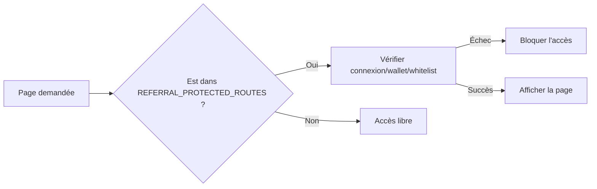

# Guide de la Page de Gestion des Referrals

## ⚙️ Intégration technique
Les vérifications de whitelist sont désormais **centralisées** via `src/lib/referralRoutesConfig.ts`.

### Pour modifier les règles d'accès
1. Éditez `src/lib/referralRoutesConfig.ts` pour ajouter/supprimer des routes.
2. Aucune modification n'est nécessaire dans `src/app/referral-management/page.tsx` (la logique est automatiquement appliquée).

### Schéma de fonctionnement

## Fichiers impliqués
- `src/app/referral-management/page.tsx`
- `src/lib/referralRoutesConfig.ts`
- `src/lib/abi/ReferralRegistry.json`
- `src/lib/referralUtils.ts`

## Rappels
- Cette configuration n'affecte pas la page `/referral` (point d'entrée pour obtenir la whitelist).
- Utilisez `MB-[20rem]` pour les espacements verticaux lorsque pertinent.

## Liens utiles
- Connexion wallet et réseau: `../WALLET_CONNECTION_GUIDE.md`
- Implémentation des vaults: `../VAULTS_IMPLEMENTATION.md`
